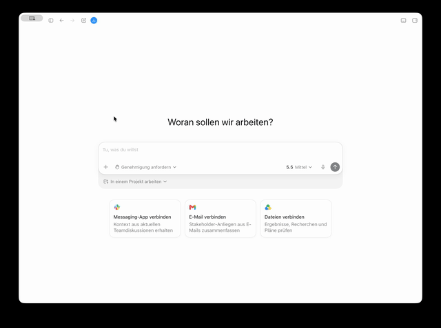

# ChurchTools MCP Server

TypeScript Streamable HTTP MCP server for ChurchTools. It exposes dedicated tools for common ChurchTools reads and updates, plus OpenAPI-backed generic search/execute tools for the long tail of the ChurchTools REST API.



## Configuration

Required environment variables:

- `CHURCHTOOLS_BASE_URL`: ChurchTools base URL, for example `https://example.church.tools`.
- `CHURCHTOOLS_AUTH_MODE`: must be `pat` for this version.
- `CHURCHTOOLS_PAT`: ChurchTools login/API token. The server forwards it as `Authorization: Login <token>`.
- `MCP_SERVER_TOKEN`: bearer token required by callers of `POST /mcp`.

Optional:

- `ALLOW_UNAUTHENTICATED_MCP=true`: disables inbound MCP bearer-token checks.
- `CHURCHTOOLS_OPENAPI_URL`: defaults to `${CHURCHTOOLS_BASE_URL}/system/runtime/swagger/openapi.json`.
- `PORT`, `HOST`, `LOG_LEVEL`, `REQUEST_TIMEOUT_MS`, `MAX_RESPONSE_BYTES`.

OAuth is intentionally deferred. MCP token pass-through to ChurchTools is not spec-compliant, so a later OAuth implementation should use a proper MCP OAuth flow where this server obtains and validates tokens for itself.

## Local Development

```bash
npm install
cp .env.example .env
npm run dev
```

Edit `.env` before starting the server. At minimum, set:

```bash
CHURCHTOOLS_BASE_URL=https://your-domain.church.tools
CHURCHTOOLS_AUTH_MODE=pat
CHURCHTOOLS_PAT=your-churchtools-login-token
MCP_SERVER_TOKEN=choose-a-token-for-mcp-clients
```

With Bun, `bun run dev` loads `.env` automatically. With npm/tsx, export the variables in your shell or use your preferred `.env` loader.
The server also loads `.env` during startup, so `npm run dev`, `bun run dev`, and `npm start` all work from the project root once `.env` exists.

The HTTP endpoints are:

- `POST /mcp`: MCP Streamable HTTP endpoint.
- `GET /health`: liveness.
- `GET /ready`: confirms the OpenAPI catalog is loaded.

## Tools

Dedicated read tools include current user, persons, person groups/events, groups, group members, events, event agenda, calendars, appointments, resources, bookings, songs, and wiki pages/categories.

Dedicated write tools:

- `churchtools_update_song`
- `churchtools_update_event`
- `churchtools_update_wiki_category`

All write tools use MCP elicitation for confirmation when supported. If the client does not advertise elicitation support, the tool returns `confirmation_required`; retry the same tool with `confirm=true` after user confirmation.

Generic OpenAPI tools:

- `churchtools_search_actions`
- `churchtools_execute_read_action`
- `churchtools_execute_write_action`

## Docker

```bash
docker build -t churchtools-mcp-server .
docker run --rm -p 3000:3000 --env-file .env churchtools-mcp-server
```

Or use `docker-compose.example.yml` as a starting point.
